# ☩ Logos

## The Liturgical Programming Language

> *"In the beginning was the Word, and the Word was with God, and the Word was God."* — John 1:1

**Logos** is an esoteric, imperative programming language whose syntax draws inspiration from Orthodox Christian liturgy and theological concepts. Beneath its uniquely themed surface, Logos functions as a robust, interpreted language built on Python and leveraging the `Lark` parsing library. It features advanced capabilities such as **Tail Call Optimization (TCO)** for efficient recursion, a **Foreign Function Interface (FFI)** powered by `ctypes`, comprehensive **Runtime Type Enforcement**, and a dedicated **Language Server Protocol (LSP)** implementation for enhanced developer experience.

---

## 🔥 Quickstart: Embarking on the Pilgrimage

To begin your journey with Logos, ensure you have **Python 3.10+** installed.

1.  **Clone the Repository:**
    ```bash
    git clone https://github.com/nikanats/nikanats-logos.git
    cd nikanats-logos
    ```

2.  **Set Up Virtual Environment:**
    It is best practice to work within a virtual environment to manage dependencies.
    ```bash
    python -m venv .venv
    # Activate on Linux/macOS:
    source ./.venv/bin/activate
    # Activate on Windows (Cmd/Git Bash):
    ./.venv/Scripts/activate
    # Activate on Windows (PowerShell):
    ./.venv/Scripts/Activate.ps1
    ```

3.  **Install Core Dependencies:**
    The Logos interpreter relies primarily on `lark`.
    ```bash
    pip install lark
    ```

4.  **Run a Sample Liturgy:**
    Execute the `smoke_test.lg` example to confirm everything is working:
    ```bash
    python logos.py examples/smoke_test.lg
    ```
    This script performs basic system checks, including time, math, and file I/O operations, proclaiming the results to your console.

5.  **Interactive Confessional (REPL):**
    For immediate exploration, run Logos in interactive mode:
    ```bash
    python logos.py
    ```
    Type `silence;` to execute a statement and `exit` or `depart(0);` to leave.

---

## 📜 The Canon: Core Capabilities and Dogmas

Logos is designed with specific "canonical" principles, offering a unique set of programming capabilities:

*   **Liturgical Syntax**: Core language constructs are re-imagined with theological terms:
    *   `mystery`: Function definition
    *   `vigil` / `confess`: Exception handling (try/catch)
    *   `icon`: Data structure (struct/object) definition
    *   `proclaim`: Output to console (print)
    *   `offer`: Return value
*   **The Apocrypha (FFI)**: Seamlessly bind and call functions from native C libraries (shared objects on Unix-like systems, DLLs on Windows) using the `apocrypha` keyword.
*   **Runtime Type Dogma**: Logos supports optional gradual typing (e.g., `inscribe x: HolyInt`). These type annotations are strictly enforced at runtime and validated by the LSP.
*   **Tail Call Optimization (TCO)**: To prevent "Pride" (recursion depth exceeded errors), Logos implements a trampolining mechanism for tail-recursive `mystery` invocations.
*   **The Iconostasis (Structs)**: Define custom data structures using `icon`. These icons support field validation during instantiation (`write Icon { ... }`) and mutable attributes.
*   **LSP Support**: A custom Language Server, powered by Python's `pygls` library, provides real-time diagnostics, syntax validation, and semantic highlighting for compatible editors like VS Code.

---

## 🕯️ Syntax at a Glance: Speaking the Sacred Tongue

### Variables & Types

*   Declare variables with `inscribe`.
*   Modify existing variables using `amend`.
*   Primitive types: `HolyInt` (int), `HolyFloat` (float), `Text` (string), `Bool` (`Verily`/`Nay`).
*   Aggregate types: `Procession` (list), `Icon` (struct).

```logos
// Declare an integer variable 'age'
inscribe age: HolyInt = 30;
// Mutate the value of 'age'
amend age = 31;
// Declare a string variable 'name'
inscribe name: Text = "Theophilus";
// Proclaim values to the console
proclaim name + " is " + transfigure age into Text; // Output: Theophilus is 31
```

### Control Flow: Chants, Discernment, and Contemplation

*   **Loops**: `chant` (while loop).
*   **Conditionals**: `discern` / `otherwise` (if/else).
*   **Pattern Matching**: `contemplate` / `aspect` (switch/match).

```logos
// A chant (while loop)
chant age < 100 {
    amend age = age + 1;
    proclaim age;
} amen // 'amen' signifies the end of a block

// A discernment (if-else)
discern (age >= 100) {
    proclaim "A century of devotion reached.";
} otherwise {
    proclaim "Pilgrimage continues.";
} amen

// Contemplation (pattern matching)
contemplate (age) {
    aspect 100: proclaim "The time is fulfilled.";
    aspect _:   proclaim "Still journeying...";
} amen
```

### Mysteries (Functions)

Functions are defined as `mystery` and values are returned using `offer`.

```logos
mystery calculate_penance(sins: HolyInt) -> HolyInt {
    discern (sins > 10) {
        offer sins * 2;
    } otherwise {
        offer sins;
    } amen
} amen
```

### The Vigil (Error Handling)

```logos
vigil {
    inscribe x = 1 / 0; // Runtime error
} confess sin {
    proclaim "A fault occurred during the vigil:";
    proclaim sin;
} amen
```

### The Apocrypha (Foreign Function Interface)

```logos
// Binds to the 'cos' function in msvcrt.dll (Windows) or libm.so (Linux)
apocrypha "msvcrt" mystery cos(x: HolyFloat) -> HolyFloat;

inscribe pi = 3.14159;
proclaim cos(pi); // Output: ~ -1.0
```

---

## 🛠️ Tooling: The Iconostasis (VS Code Extension)

The Logos VS Code extension resides in `packages/logos-vscode` and provides syntax highlighting and LSP diagnostics.

### Installation & Development

1.  **Navigate to the Extension Directory:**
    ```bash
    cd packages/logos-vscode
    ```
2.  **Install Node.js Dependencies:**
    ```bash
    npm install
    ```
3.  **Language Server Dependencies:**
    ```bash
    pip install -r server/requirements.txt
    ```
4.  **Launch Extension Development Host:**
    In VS Code, press `F5` to open a window with the extension loaded.

### Bundled Server (Recommended for Distribution)

The extension can ship with a bundled native executable of the Language Server (built with PyInstaller), eliminating the Python requirement for end-users.

*   **Building the Windows Server Binary:**
    ```powershell
    cd packages\logos-vscode\server
    .\build_server_win.ps1
    ```
    This generates `packages\logos-vscode\server\bin\win32\logos-lang-server.exe`.

---

## 🧪 Testing: The Inquisitor's Examination

Logos maintains a robust test suite to ensure the integrity of its "Canon."

To run all tests:

```bash
python -m unittest discover tests
```

To include coverage reports:

```bash
pip install coverage
coverage run -m unittest discover tests
coverage report -m
```

The suite covers grammar, runtime internals (`logos_lang`), security sandboxing, and LSP protocol integrity.

---

## 🏛️ Directory Layout: The Grand Design

The project is architected into the core language package, the standard library (lib), and external tooling.

```
nikanats-logos/
├── logos.py                 # Entrypoint: CLI and REPL wrapper.
├── logos_lang/              # The Core Logic (The Soul):
│   ├── interpreter.py       # The Runtime (The Spirit).
│   ├── grammar.py           # The Grammar Definition (Lark).
│   ├── ffi.py               # Foreign Function Interface logic.
│   ├── scope.py             # Variable scoping and stack management.
│   ├── stdlib.py            # Native Python bindings for the Standard Lib.
│   └── ...                  # Models, Types, and Module management.
├── lib/                     # The Standard Library (The Canon - .lg files):
│   ├── canon.lg             # General utilities.
│   ├── genesis.lg           # System, Time, and File I/O.
│   ├── numeri.lg            # Mathematics.
│   └── psalms.lg            # String manipulation.
├── examples/                # Small liturgies showcasing features.
├── programs/                # Complex, multi-file programs (e.g., monk.lg, creed.lg).
├── packages/                # Editor integrations:
│   ├── logos-vscode/        # The primary VS Code extension.
│   │   ├── server/          # Python-based LSP implementation.
│   │   ├── src/             # TypeScript client.
│   │   └── syntaxes/        # TextMate grammar.
│   └── logos-liturgy/       # (Legacy) Alternative client structure.
└── tests/                   # The Inquisitor (Test Suite):
    ├── fixtures/            # Isolated code snippets for testing.
    ├── fuzz/                # Fuzz testing for parser stability.
    ├── security/            # Security regression tests (sandbox escapes).
    └── stress/              # TCO benchmark tests.
```

---

## 🏗️ Architecture: The Divine Order

### The Pilgrim's Journey: Workflow Overview

```mermaid
graph TD
    User("👤 <b>The Pilgrim</b><br/>(User)")

    subgraph Stage1 ["🟦 Phase 1: Creation"]
        direction LR
        Editor("📝 <b>VS Code</b><br/>(Client)")
        LSP("💡 <b>Logos Server</b><br/>(LSP/pygls)")
    end

    subgraph Stage2 ["🟪 Phase 2: Execution"]
        direction LR
        CLI("logos.py")
        Core("⚙️ <b>logos_lang</b><br/>(Interpreter)")
        Lib("📚 <b>lib/*.lg</b><br/>(Canon)")
    end

    subgraph Stage3 ["🟩 Phase 3: Revelation"]
        Console("🖥️ <b>Proclamation</b><br/>(Output)")
    end

    User ==>|Writes| Editor
    Editor <-->|Diagnostics| LSP
    User ==>|Executes| CLI
    CLI --> Core
    Core -->|Imports| Lib
    Core -->|Proclaims| Console
```



---

## ⚖️ License

This project is licensed under the **MIT License**.

*Copyright (c) 2025 NikaNats*