# ☩ Logos

## The Liturgical Programming Language

> *"In the beginning was the Word, and the Word was with God, and the Word was God."* — John 1:1

**Logos** is an esoteric, imperative programming language whose syntax draws inspiration from Orthodox Christian liturgy and theological concepts. Beneath its uniquely themed surface, Logos functions as a robust, interpreted language built on Python and leveraging the `Lark` parsing library. It features advanced capabilities such as **Tail Call Optimization (TCO)** for efficient recursion, a **Foreign Function Interface (FFI)** powered by `ctypes`, comprehensive **Runtime Type Enforcement**, and a dedicated **Language Server Protocol (LSP)** implementation for enhanced developer experience.

---

## 🔥 Quickstart: Embarking on the Pilgrimage

To begin your journey with Logos, ensure you have **Python 3.10+** installed.

1.  **Clone the Repository:**
    ```bash
    git clone https://github.com/nikanats/nikanats-logos.git
    cd nikanats-logos
    ```

2.  **Set Up Virtual Environment:**
    It's best practice to work within a virtual environment to manage dependencies.
    ```bash
    python -m venv .venv
    # Activate on Linux/macOS:
    source ./.venv/bin/activate
    # Activate on Windows (Cmd/Git Bash):
    ./.venv/Scripts/activate
    # Activate on Windows (PowerShell):
    ./.venv/Scripts/Activate.ps1
    ```

3.  **Install Core Dependencies:**
    The Logos interpreter itself relies primarily on `lark`.
    ```bash
    pip install lark
    ```

4.  **Run a Sample Liturgy:**
    Execute the `smoke_test.lg` example to confirm everything is working:
    ```bash
    python logos.py examples/smoke_test.lg
    ```
    This script performs basic system checks, including time, math, and file I/O operations, proclaiming the results to your console.

5.  **Interactive Confessional (REPL):**
    For immediate exploration, run Logos in interactive mode:
    ```bash
    python logos.py
    ```
    Type `silence;` to execute a statement and `exit` or `depart(0);` to leave.

---

## 📜 The Canon: Core Capabilities and Dogmas

Logos is designed with specific "canonical" principles, offering a unique set of programming capabilities:

*   **Liturgical Syntax**: Core language constructs are re-imagined with theological terms, such as `mystery` for functions, `vigil` and `confess` for structured error handling (try/catch), `icon` for defining data structures, `proclaim` for output, and `offer` for returning values.
*   **The Apocrypha (FFI)**: Seamlessly bind and call functions from native C libraries (shared objects on Unix-like systems, DLLs on Windows) using the `apocrypha` keyword, enabling interaction with external system capabilities.
*   **Runtime Type Dogma**: Logos supports optional gradual typing (e.g., `inscribe x: HolyInt`). These type annotations are not only validated statically by the LSP but are also strictly enforced at runtime, ensuring canonical type correctness.
*   **Tail Call Optimization (TCO)**: To prevent "Pride" (recursion depth exceeded errors), Logos implements a trampolining mechanism for tail-recursive `mystery` invocations, allowing for deep and potentially infinite recursion without overflowing the Python call stack.
*   **The Iconostasis (Structs)**: Define custom data structures using `icon` to encapsulate related data. These icons support field validation during instantiation (`write Icon { ... }`) and runtime access/mutation.
*   **LSP Support**: A custom Language Server, powered by Python's `pygls` library, provides real-time diagnostics, syntax validation, and semantic highlighting for Logos files within compatible editors like VS Code.

---

## 🕯️ Syntax at a Glance: Speaking the Sacred Tongue

### Variables & Types

*   Declare variables with `inscribe`, optionally annotating their `type`.
*   Modify existing variables or attributes using `amend`.
*   Primitive types include `HolyInt` (integer), `HolyFloat` (floating-point), `Text` (string), and `Bool` (boolean, represented by `Verily` and `Nay`).
*   Aggregate types include `Procession` (lists) and `Icon` (user-defined structs/objects).

```logos
// Declare an integer variable 'age'
inscribe age: HolyInt = 30;
// Mutate the value of 'age'
amend age = 31;
// Declare a string variable 'name'
inscribe name: Text = "Theophilus";
// Proclaim values to the console
proclaim name + " is " + transfigure age into Text; // Output: Theophilus is 31
```

### Control Flow: Chants, Discernment, and Contemplation

*   **Loops**: The `chant` keyword facilitates repetitive actions, akin to a `while` loop.
*   **Conditionals**: `discern` and `otherwise` provide standard if-else branching.
*   **Pattern Matching**: `contemplate` combined with `aspect` allows for powerful pattern matching, similar to `switch` or `match` statements, supporting literal values and a wildcard (`_`).

```logos
// A chant (while loop)
chant age < 100 {
    amend age = age + 1;
    proclaim age;
} amen // 'amen' signifies the end of a block

// A discernment (if-else)
discern (age >= 100) {
    proclaim "A century of devotion reached.";
} otherwise {
    proclaim "Pilgrimage continues.";
} amen

// Contemplation (pattern matching)
contemplate (age) {
    aspect 100: proclaim "The time is fulfilled.";
    aspect _:   proclaim "Still journeying..."; // Wildcard matches any other value
} amen
```

### Mysteries (Functions)

Functions are defined as `mystery`. They can declare parameters with optional type annotations and return types. Values are returned using `offer`.

```logos
mystery calculate_penance(sins: HolyInt) -> HolyInt {
    discern (sins > 10) {
        offer sins * 2; // Returns twice the penance for many sins
    } otherwise {
        offer sins;
    } amen
} amen

proclaim calculate_penance(7);  // Output: 7
proclaim calculate_penance(12); // Output: 24
```

### The Vigil (Error Handling)

The `vigil` block allows for handling runtime exceptions, similar to a `try-catch` block. Errors are bound to a specified variable in the `confess` clause.

```logos
vigil {
    inscribe x = 1 / 0; // This will cause a runtime error
} confess sin {
    proclaim "A fault occurred during the vigil:";
    proclaim sin; // 'sin' will contain the error message
} amen
// Output:
// ☩ A fault occurred during the vigil:
// ☩ division by zero
```

### The Apocrypha (Foreign Function Interface)

The `apocrypha` keyword enables binding to external C functions within shared libraries or DLLs.

```logos
// Binds to the 'cos' function in msvcrt.dll (Windows) or libm.so (Linux)
// It expects a Float argument and returns a Float.
apocrypha "msvcrt" mystery cos(x: HolyFloat) -> HolyFloat;

inscribe pi = 3.14159;
inscribe result = cos(pi);
proclaim "Cos(PI) should be near -1:";
proclaim result; // Output: ☩ -0.9999999999999999
```

---

## 🛠️ Tooling: The Iconostasis (VS Code Extension)

The Logos VS Code extension provides a rich development experience with syntax highlighting and real-time LSP diagnostics. It resides in the `packages/logos-vscode` directory.

### Installation & Development

1.  **Navigate to the Extension Directory:**
    ```bash
    cd packages/logos-vscode
    ```
2.  **Install Node.js Dependencies:**
    The VS Code extension client requires Node.js and `npm`.
    ```bash
    npm install
    ```
3.  **Language Server Dependencies (Python):**
    The Python-based Language Server requires `pygls` and `lark`.
    ```bash
    pip install -r server/requirements.txt
    ```
    (For developing the LSP or building a bundled server executable, you might need `pip install -r server/requirements-dev.txt` for `PyInstaller`).
4.  **Launch Extension Development Host:**
    In VS Code, press `F5`. This will open a new "Extension Development Host" window.
    Open any `.lg` file in this new window to experience Logos syntax highlighting and LSP diagnostics in action.

### Bundled Server (Recommended for Distribution)

For end-users, the VS Code extension is designed to optionally ship with a bundled native executable of the Language Server (built with PyInstaller). This eliminates the need for users to have Python or its dependencies installed.

*   **Building the Windows Server Binary:**
    ```powershell
    cd packages\logos-vscode\server
    .\build_server_win.ps1
    ```
    This generates `packages\logos-vscode\server\bin\win32\logos-lang-server.exe`.
*   The `extension.ts` client prioritizes finding and using this bundled executable.

The LSP's entry point is `packages/logos-vscode/server/lsp_server.py`, built on `pygls` and `lark`. It performs detailed syntax parsing and semantic analysis to offer precise feedback.

---

## 🧪 Testing: The Inquisitor's Examination

Logos maintains a robust test suite to ensure the integrity and correctness of its "Canon."

To run all tests:

```bash
python -m unittest discover tests
```

For a detailed coverage report (requires `coverage` package):

```bash
pip install coverage
coverage run -m unittest discover tests
coverage report -m
```

The test suite thoroughly examines:
*   **Grammar & Semantics**: Verification of core language constructs and their expected behavior.
*   **Runtime Internals**: Testing of the `ScopeManager`, `FFIManager`, `StdLib`, and intricacies like tail-call optimization and recursion handling.
*   **LSP Diagnostics**: Confirmation that the Language Server correctly identifies and reports "heresies" (errors) and "schisms" (warnings) in Logos code.

---

## 🏛️ Directory Layout: The Grand Design

The project's structure reflects its comprehensive nature:

```
nikanats-logos/
├── logos.py                 # The Interpreter: Main entry point and runtime logic.
├── .coveragerc              # Configuration for code coverage reports.
├── lib/                     # The Standard Library (The Canon):
│   ├── canon.lg             # General purpose utilities and common patterns.
│   ├── genesis.lg           # System interactions, time, and file I/O.
│   ├── numeri.lg            # Mathematical functions.
│   └── psalms.lg            # String manipulation routines.
├── examples/                # Example liturgies showcasing language features.
├── packages/                # Tooling and editor integrations:
│   ├── logos-liturgy/       # An alternative/older VS Code client structure (for context).
│   └── logos-vscode/        # The primary VS Code extension:
│       ├── server/          # Python-based Language Server Protocol (LSP) implementation.
│       ├── src/             # TypeScript source for the VS Code extension client.
│       └── syntaxes/        # TextMate grammar for syntax highlighting.
├── programs/                # Larger, more complex Logos programs.
└── tests/                   # The Inquisitor (Test Suite):
    ├── fixtures/            # Small, isolated code snippets for specific test cases.
    └── ...                  # Python unit tests for the interpreter, LSP, etc.
```

---

## 🏗️ Architecture: The Divine Order

### The Pilgrim's Journey: Workflow Overview

```mermaid
graph TD
    %% ==========================================
    %% DESIGN & PALETTE (Material Pastel)
    %% ==========================================
    classDef userNode fill:#ffccbc,stroke:#d84315,stroke-width:3px,rx:15,ry:15,color:#333;
    classDef inputZone fill:#e3f2fd,stroke:#1e88e5,stroke-width:2px,rx:10,ry:10,color:#0d47a1;
    classDef logicZone fill:#f3e5f5,stroke:#8e24aa,stroke-width:2px,rx:10,ry:10,color:#4a148c;
    classDef resultZone fill:#e8f5e9,stroke:#43a047,stroke-width:2px,rx:10,ry:10,color:#1b5e20;

    %% ==========================================
    %% 1. THE USER (Top Level)
    %% ==========================================
    User("👤 <b>The Pilgrim</b><br/>(User)"):::userNode

    %% ==========================================
    %% STAGE 1: CREATION (Layer 1)
    %% ==========================================
    subgraph Stage1 ["🟦 Phase 1: Creation"]
        direction LR
        Editor("📝 <b>VS Code Editor</b><br/>(Writes .lg files)"):::inputZone
        LSP("💡 <b>The Iconostasis</b><br/>(Auto-detects errors)"):::inputZone
    end

    %% ==========================================
    %% STAGE 2: EXECUTION (Layer 2)
    %% ==========================================
    subgraph Stage2 ["🟪 Phase 2: Execution"]
        direction LR
        Runtime("⚙️ <b>Logos Runtime</b><br/>(Interpreter)"):::logicZone
        Canon("📚 <b>The Canon</b><br/>(Standard Lib)"):::logicZone
    end

    %% ==========================================
    %% STAGE 3: REVELATION (Layer 3)
    %% ==========================================
    subgraph Stage3 ["🟩 Phase 3: Results"]
        direction LR
        Console("🖥️ <b>Terminal</b><br/>(Text Output)"):::resultZone
        FileSys("💾 <b>File System</b><br/>(Data/Logs)"):::resultZone
    end

    %% ==========================================
    %% THE FLOW
    %% ==========================================

    %% Main Downward Flow
    User ==>|1. Writes Code| Editor
    Editor ==>|3. Runs Code| Runtime
    Runtime ==>|4. Proclaims| Console

    %% Internal/Horizontal Logic
    Editor -.->|2. Real-time checking| LSP
    LSP -.->|Red squiggly lines| Editor
    
    Runtime -.->|Uses Math/Time| Canon
    Runtime -.->|Writes| FileSys

    %% Long Feedback Loop (Bottom to Top)
    Console -.->|5. Reads & Verification| User
```



---

## ⚖️ License

This project is licensed under the **MIT License**.

*Copyright (c) 2025 NikaNats*